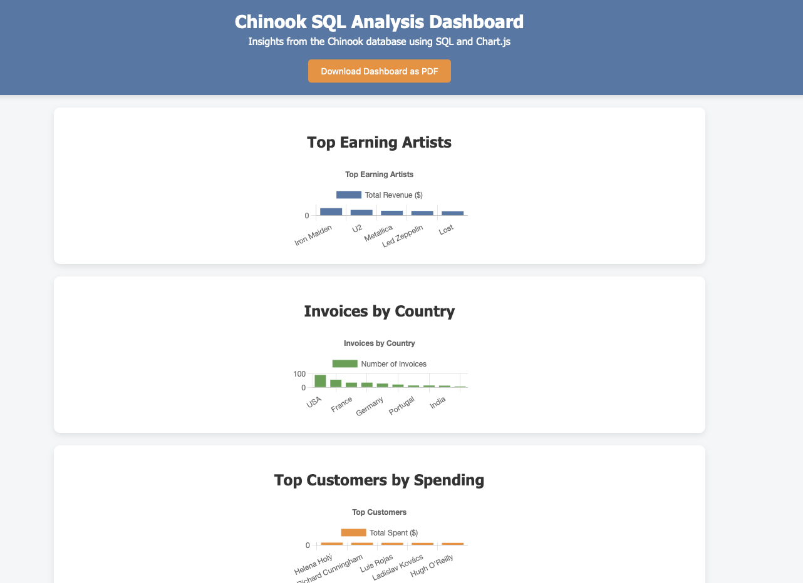

# 🎧 Chinook SQL Analysis Dashboard

## 📌 Overview
This project analyzes the **Chinook digital music store** database using SQL, Python, and Chart.js. It generates an **interactive dashboard** where you can visualize insights and download them as a PDF.

---

## ✅ Key Insights
- **Iron Maiden** leads in revenue with $138.60.
- **USA** generates the most invoices (91 total).
- **Helena Holý** is our top customer, spending $49.62.
- **Iron Maiden** also has the largest track catalog (213 tracks).

---

## 🛠️ Tech Stack
- **SQL**: Extract and aggregate data
- **Python (pandas)**: Prepare data for visualization
- **Chart.js**: Interactive charts
- **HTML/CSS**: Dashboard UI
- **jsPDF + html2canvas**: PDF export feature

---

## 📷 Dashboard Preview

---

## ▶ How to Run
1. Clone or download this project.
2. Open `index.html` in any modern browser (Chrome, Edge, Firefox).
3. Use the **Download as PDF** button to export the dashboard.

---

## 📚 Dataset
[Chinook Database](https://github.com/lerocha/chinook-database)

---

## ☕ Support
[Buy Me a Coffee](https://www.buymeacoffee.com/yourusername)
